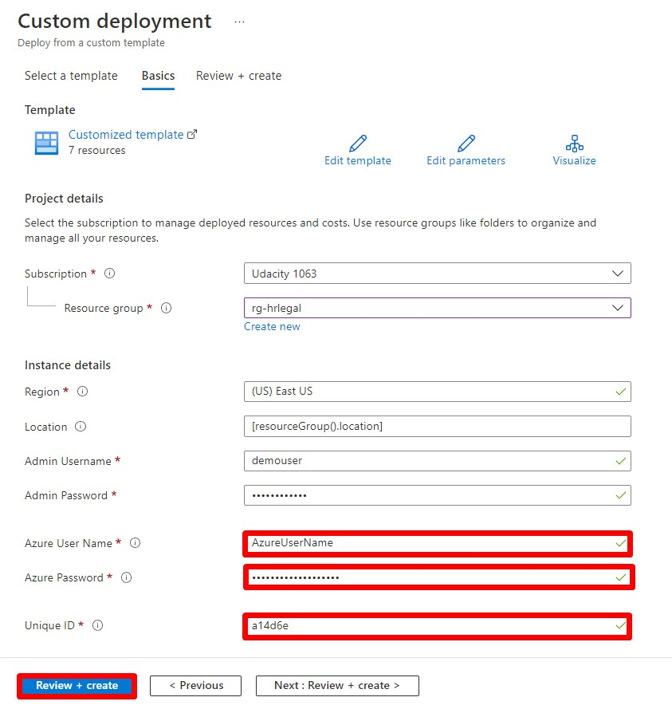

# Cloud Architect Nanodegree Course 2 Project

## Before you start (Pre-requisites & Points to remember )

1. Consider an alphanumeric string of 6 values starting with an alphabet in lowercase, that you need to use as **UniqueID** for the rest of the lab. For example: **a14d6e**.

2. Create/Ddeploy all the resource groups and resources in the same region

3. Select the region only in the **Region** property. Do not make any modifications to **Location** property "[resourceGroup().location]". 

## Deployment Guide

### 1. Deploy to Resource Group: JumpVM

**a) Files to download:**  
Download the files "deploy-01.json" and "deploy-01.parameters.json" available in the path "Udacity/CloudArchitect/Course2/Project/RG-JumpVM/".

**b) Create Resource Group:**  
Create a resource group with name JumpVM.

**c) Deploy:**  
Deploy the file to JumpVM resource group by providing your AzureUserName, AzurePassword and the UniqueID.

------------------------------------------------------------------

### 2. Deploy to Resource Group: Udacity

**a) Files to download:**  
Download the files "deploy-01.json" and "deploy-01.parameters.json" available in the path "Udacity/CloudArchitect/Course2/Project/RG-Udacity/".

**b) Create Resource Group:**  
Create a resource group with name Udacity.

**c) Deploy:**  
Deploy the file to Udacity resource group by providing your AzureUserName, AzurePassword and the UniqueID.

------------------------------------------------------------------

### 3. Deploy to Resource Group: UdacityDemo

**a) Files to download:**  
Download the files "deploy-01.json" and "deploy-01.parameters.json" available in the path "Udacity/CloudArchitect/Course2/Project/RG-UdacityDemo/".

**b) Create Resource Group:**  
Create a resource group with name UdacityDemo.

**c) Deploy:**  
Deploy the file to UdacityDemo resource group by providing only the UniqueID.

------------------------------------------------------------------

