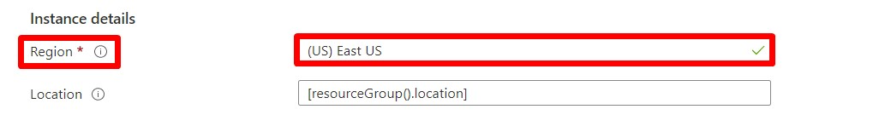

# Cloud Architect Nanodegree Course 3 Project

## Before you start (Pre-requisites & Points to remember )

1. Consider an alphanumeric string of 6 values starting with an alphabet in lowercase, that you need to use as **UniqueID** for the rest of the lab. For example: **a14d6e**.

2. Deploy all the resources in the same region

3. Select the region only in the **Region** property. Do not make any modifications to **Location** property "[resourceGroup().location]". 

## Deployment Guide

### 1. Deploy to Resource Group: rg-data

**a) Files to download:**  
Download the files "deploy-02.json" and "deploy-02.parameters.json" available in the path "Udacity/CloudArchitect/Course3/Project/rg-data".

**b) Deploy:**  
Deploy the files in Azure after providing the UniqueID value.
